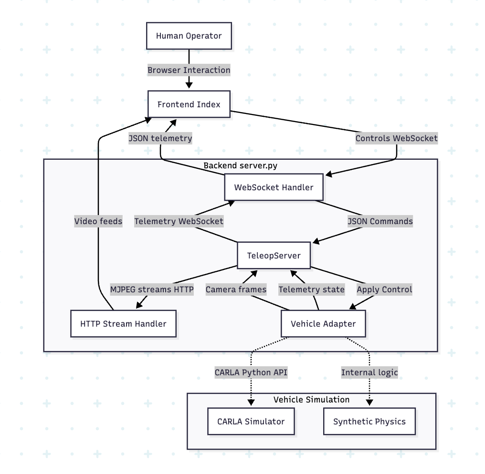
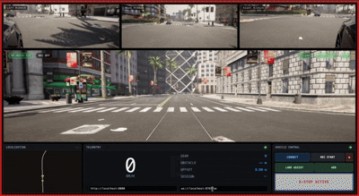

# Remote CARLA Simulation & Teleoperation Setup Guide


This guide details the process of setting up a remote GPU instance (e.g., Vast.ai, AWS, Azure) to run the CARLA simulator in headless mode and connecting a local web-based teleoperation cockpit to it.

## System Overview

The ReDrive system is designed to provide a low-latency, high-fidelity teleoperation experience by decoupling the simulation engine (CARLA) from the operator's interface. It utilizes a containerized backend running on GPU-accelerated infrastructure to handle physics and rendering, streaming data via WebRTC/WebSocket to a lightweight client-side cockpit. This architecture ensures scalability and enables operations even on standard consumer hardware.

<p align="center">
  
</p>

The simulator preview below demonstrates the real-time operational capability of the system. Operators receive multi-view video feeds (panoramic, mirrors, rear) alongside telemetry overlay, providing situational awareness comparable to in-vehicle operation.

<p align="center">
  
</p>


## Prerequisites

1.  **Remote Machine:**
    *   OS: Ubuntu 22.04 LTS (recommended).
    *   GPU: NVIDIA GPU with drivers installed.
    *   Root or sudo access.
2.  **Local Machine:**
    *   SSH Client (Terminal, PowerShell, etc.).
    *   Web Browser (Chrome recommended).

## Step 1: Connect to the Remote Instance

SSH into your remote instance. Replace `<IP_ADDRESS>` and `<PORT>` with your instance's details.

```bash
ssh root@<IP_ADDRESS> -p <PORT>
```

> **Note:** If prompted, accept the host key fingerprint.

---

## Step 2: Environment Setup (Remote)

Perform these steps on the remote server to prepare the environment.

### 2.1 Verify GPU Availability
Ensure the NVIDIA drivers are working correctly.

```bash
nvidia-smi
```
*Expected Output:* A table listing your GPU (e.g., RTX 3090, 4090) and driver version.

### 2.2 Install Docker Engine
Remove conflicting packages and install the official Docker Engine.

```bash
# Clean up potential conflicting packages
apt remove -y docker.io containerd || true
apt autoremove -y

# Setup Docker repository
apt update -y
apt install -y ca-certificates curl gnupg lsb-release git unzip

mkdir -m 0755 -p /etc/apt/keyrings
curl -fsSL https://download.docker.com/linux/ubuntu/gpg | gpg --dearmor -o /etc/apt/keyrings/docker.gpg
echo "deb [arch=$(dpkg --print-architecture) signed-by=/etc/apt/keyrings/docker.gpg] https://download.docker.com/linux/ubuntu $(lsb_release -cs) stable" | tee /etc/apt/sources.list.d/docker.list > /dev/null

# Install Docker
apt update -y
apt install -y docker-ce docker-ce-cli containerd.io docker-buildx-plugin docker-compose-plugin
systemctl enable --now docker
```

### 2.3 Install NVIDIA Container Toolkit
This allows Docker containers to access the full power of your GPU.

```bash
curl -fsSL https://nvidia.github.io/libnvidia-container/gpgkey | gpg --dearmor -o /usr/share/keyrings/nvidia-container-toolkit-keyring.gpg
curl -fsSL https://nvidia.github.io/libnvidia-container/stable/deb/libnvidia-container.list | sed 's#deb https://#deb [signed-by=/usr/share/keyrings/nvidia-container-toolkit-keyring.gpg] https://#g' > /etc/apt/sources.list.d/nvidia-container-toolkit.list

apt update
apt install -y nvidia-container-toolkit
nvidia-ctk runtime configure --runtime=docker
systemctl restart docker
```

**Verify Setup:**
```bash
docker run --rm --gpus all nvidia/cuda:12.4.1-base-ubuntu22.04 nvidia-smi
```
*If this command displays the GPU table, you are ready to proceed.*

---

## Step 3: Run CARLA Simulator (Headless)

We will use the official CARLA Docker image.

### 3.1 Pull and Run CARLA
This command runs CARLA in off-screen mode so it doesn't require a physical monitor.

```bash
docker pull carlasim/carla:0.9.15

docker run -d --name carla \
  --gpus all \
  --net=host \
  --shm-size=8g \
  carlasim/carla:0.9.15 \
  /bin/bash -lc "./CarlaUE4.sh -RenderOffScreen -nosound -quality-level=Low -world-port=2000 -carla-rpc-port=2000"
```

* Flags Explained:
    * `--net=host`: Simplifies networking by using the host's stack.
    * `-RenderOffScreen`: Critical for headless remote servers.
    * `-quality-level=Low`: Improves performance for testing.

### 3.2 Verify CARLA Status
Check that the container is running and listening on port 2000.

```bash
docker ps --filter name=carla
# Check for listening port (wait 30-60s after start)
ss -lntp | grep 2000
```

---

## Step 4: Deploy the Teleoperation Backend

You need to transfer your project code (`server.py`, `requirements.txt`, etc.) to the remote server.

### 4.1 Upload Code (From Local Machine)
Zip your project folder locally and use `scp` to copy it.

```bash
# On your LOCAL machine
tar -czf redrive_local_demo.tgz -C /path/to/project .
scp -P <PORT> redrive_local_demo.tgz root@<IP_ADDRESS>:/root/
```

### 4.2 Setup Project (On Remote Machine)
Unpack the project and set up a Python virtual environment.

```bash
# On the REMOTE machine
cd /root
mkdir -p redrive_local_demo
tar -xzf redrive_local_demo.tgz -C redrive_local_demo
cd redrive_local_demo

# Install Python venv
apt install -y python3-venv

# Create a FRESH virtual environment (Crucial for Linux compatibility)
python3 -m venv .venv
source .venv/bin/activate
pip install --upgrade pip

# Install dependencies
pip install -r requirements.txt
pip install carla==0.9.15
```

---

## Step 5: Start the Backend Service

Run the backend server in "CARLA mode" to connect to the Docker container.

```bash
# Ensure you are inside the redrive_local_demo directory with venv activated
export MODE=carla
export CARLA_HOST=127.0.0.1
export CARLA_PORT=2000

# Start the server
python3 backend/server.py
```

*Expected Output:*
```
[CARLA] Connecting to 127.0.0.1:2000...
[CARLA] Vehicle engaged...
UI: http://localhost:8080
WS: ws://localhost:8765/ws
```

---

## Step 6: Connect from your Local Laptop

Since the server is remote, we use SSH Local Forwarding to securely access the web interface without exposing ports to the public internet.

### 6.1 Create SSH Tunnel
On your **Local Machine**, open a new terminal window and run:

```bash
ssh -N -p <PORT> root@<IP_ADDRESS> -L 8080:localhost:8080 -L 8765:localhost:8765
```
*Leave this terminal window open.*

### 6.2 Open the Cockpit
Open your web browser and navigate to:
**[http://localhost:8080](http://localhost:8080)**

You should now see the simulation feed and be able to control the vehicle using your keyboard (WASD).

---

## Troubleshooting

*   **"Connection Refused" in Browser:** Ensure your SSH tunnel is running and that `server.py` is actively running on the remote machine.
*   **CARLA Crashes:** Check logs with `docker logs --tail 100 carla`. Ensure `--gpus all` was passed and NVIDIA drivers are healthy.
*   **Port Conflicts:** Ensure ports 8080, 8765, and 2000 are not used by other services on the remote machine.
